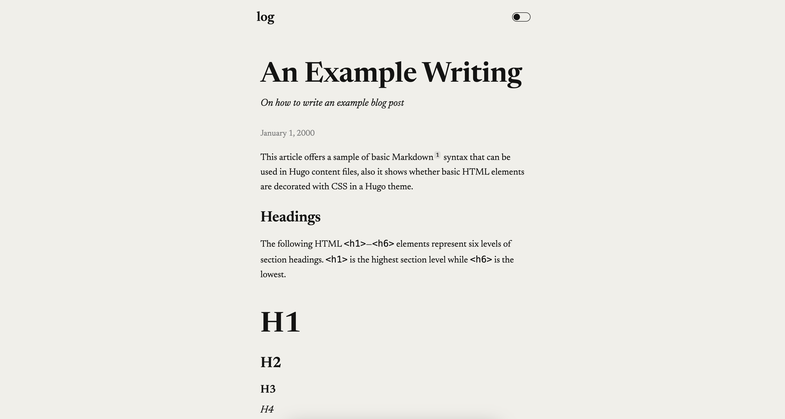

# log

[](https://github.com/GrantBirki/log/actions/workflows/deploy.yml)
[](https://github.com/GrantBirki/log/actions/workflows/unlock-on-merge.yml)
[](https://github.com/GrantBirki/log/actions/workflows/ci.yml)

A personal web log based on my [Dario](https://github.com/GrantBirki/dario) Hugo theme.

View the [live demo](https://log.birki.io) to see what it looks like.



## Development

To run the site locally, simply run:

```bash
hugo server -D
```

Now you can visit [`localhost:1313`](http://localhost:1313/) to see the site.

### Open Graph Images

If you wish to render open graph images, you can use the following commands:

```bash
npm install
script/images
```

Then copy the resulting PNGs that got generated from the front matter of your blog posts into their corresponding `content/posts/<post-name>` directories.

The text on the open graph images comes from the following front matter fields of a blog post:

```yaml
ogTitle: Grant Birkinbine
ogDescription: "An example of using the Dario hugo theme"
```

After you drop the resulting PNGs into your `content/posts/<post-name>` directories, you can point the following front matter field to the PNG file:

```yaml
ogImage: /posts/example/og.png
```
